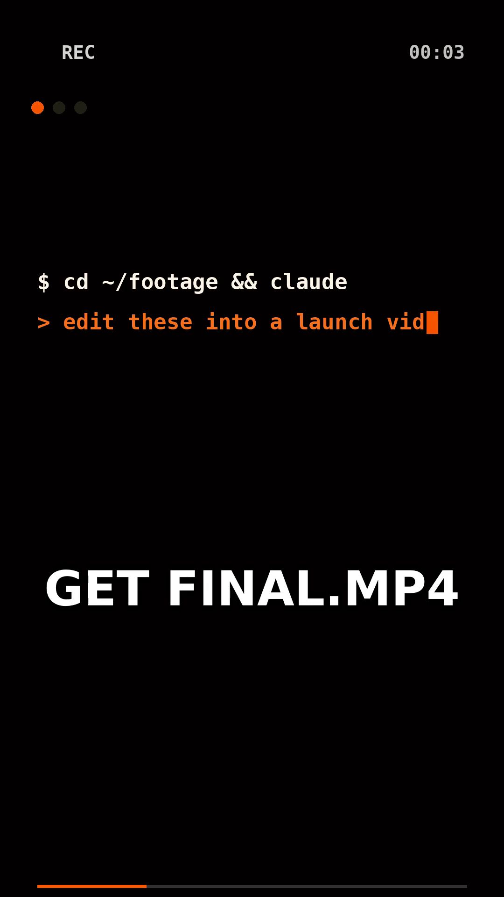

# Launch demo — a sample built with video-use

A 15-second vertical promo (1080×1920) that shows the **video-use render
pipeline** end to end. There's no real footage and no ElevenLabs key involved:
`build.py` *synthesizes* three short source clips (standing in for raw takes),
one eased alpha-overlay animation, an EDL, and an output-timeline SRT. Then the
repo's own `helpers/render.py` does the real work — cut, grade, composite,
caption, normalize.



▶︎ `samples/launch-demo/edit/final.mp4`

## What it demonstrates

Every Hard Rule in [`SKILL.md`](../../SKILL.md) is on screen:

| Capability | Where it shows up |
|---|---|
| **Per-segment extract → lossless concat** | 3 sources, each trimmed to a 5s window, then concatenated |
| **Color grade per segment** | `warm_cinematic` preset baked into each extract |
| **30ms audio fades + loudnorm** | distinct sine-chord bed per clip, normalized to −14 LUFS |
| **Overlay animation, PTS-shifted** | the REC / timecode / progress-bar HUD (eased PIL → `qtrle` alpha) |
| **Subtitles applied LAST** | 2-word UPPERCASE captions over the overlay, bold-overlay style |
| **Self-eval** | cut-boundary + layering checks (see `edit/verify/`, `edit/project.md`) |

## Rebuild it

```bash
uv sync                 # once, from the repo root
sudo apt-get install -y ffmpeg

# 1. synthesize sources + overlay + edl + srt
uv run python samples/launch-demo/build.py

# 2. render (cut → grade → overlay → subtitles → loudnorm)
uv run python helpers/render.py samples/launch-demo/edit/edl.json \
    -o samples/launch-demo/edit/final.mp4
```

Everything is deterministic — delete `sources/` and `edit/*.mp4` and rebuild.

## Files

```
samples/launch-demo/
├── build.py                       generator for all synthetic assets
├── sources/                       synthesized "raw takes" (scene1-3.mp4)
└── edit/
    ├── edl.json                   cut decisions + grade + overlay + subtitles
    ├── master.srt                 output-timeline captions
    ├── animations/slot_1/render.mov   alpha HUD overlay
    ├── final.mp4                  ← the deliverable
    ├── project.md                 session memory (per SKILL.md)
    └── verify/                    self-eval QC frames
```

## Use real footage instead

This demo only stands in for the transcribe step. With actual footage you'd drop
clips in a folder, set `ELEVENLABS_API_KEY`, and let the agent transcribe → pack
→ reason → render. See the top-level [`README.md`](../../README.md).
