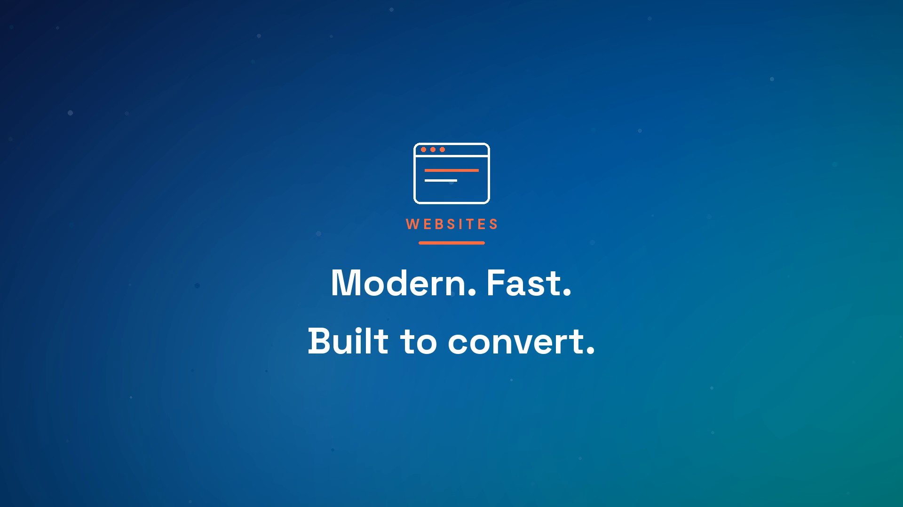

# Springs Creative Marketing — GBP promo



A 30-second, 1920×1080 promo built for the Springs Creative Marketing Google
Business Profile, generated from a client caption with **video-use**. No footage
and no ElevenLabs key — it's kinetic typography skinned with the client's real
design system.

▶︎ `final.mp4` — 1920×1080, 30.0s (Google Business Profile · GBP accepts ≤30s, ≥720p, ≤75 MB ✓)
▶︎ `final-vertical.mp4` — 1080×1920, 30.0s (Reels / TikTok / Stories)

Both carry an **original royalty-free music bed** composed in `build.py` (chord pad +
arpeggio + soft percussion, loudness-normalized to −14 LUFS) — safe to post anywhere.

## Full library (`out/`) + voiceover

`studio.py` builds the complete set: the main promo **and** a 4-part service
series (Websites, Local SEO, Social, AI Edge), each in **landscape / square /
vertical** — 15 videos. These add a **free neural voiceover** (Piper, generated
locally — no ElevenLabs/API key) ducked over the music, and a **"Book your FREE
audit" QR end card** (→ ai-audit.springsyncai.com/landing, decode-verified).

```bash
uv run python samples/springs-creative/studio.py        # all 15
uv run python samples/springs-creative/studio.py test   # main vertical only
```
The Piper voice model auto-downloads to `voices/` on first run (gitignored, ~60MB).
Captions + a posting plan + GoHighLevel setup are in `POSTING.md`.

---


Pulled straight from the client's design-system handoff:
- **Hero gradient** background (deep navy → brand blue → teal, 135°)
- **Orange** (`#FF6E42`) accent for eyebrows, emphasis, and the CTA
- **Space Grotesk** display + **DM Sans** body (their exact typefaces)
- **Inverted logo** rasterized from the brand SVG for the dark background
- Real contact + tagline: *"Where creativity springs growth."* · (919) 724-4421 · springscreativemarketing.com

## Structure (7 beats)
HOOK (locations) → BRAND (logo) → WEBSITES → LOCAL SEO → SOCIAL → AI EDGE → CTA.
On-screen text carries the message since GBP autoplays muted; a subtle synth pad
is mixed and loudness-normalized to −16 LUFS.

## Rebuild
```bash
uv run python samples/springs-creative/build.py
```
Requires `fonts/` and `assets/` (committed). The full client brand kit lives in
`brandkit/` locally but is gitignored (proprietary). All brand values are baked
into `build.py` as a single token block at the top — change them to reskin.
